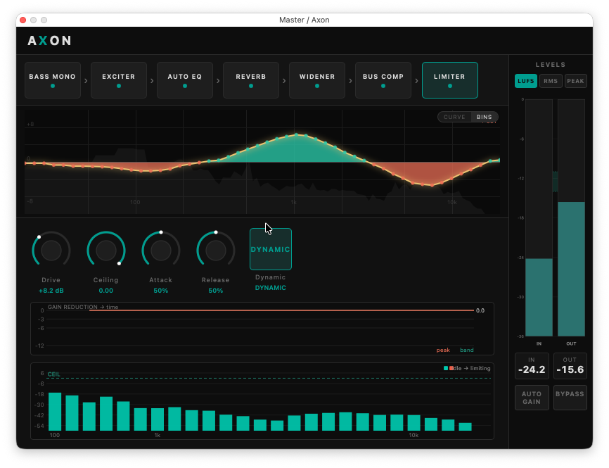

<div align="center">

# 🧠 Axon

### Adaptive **neural mastering** — an entire mastering chain in one CLAP plugin.

Differentiable DSP + learned controllers that listen to your mix and adapt EQ,
glue, space, width and loudness — in real time, inside your DAW.




</div>

---

Axon packs a complete, reorderable mastering signal path behind a single,
adaptive interface. Some stages are **neural** — a per-mix adaptive Auto-EQ and a
TCN bus compressor running on ONNX Runtime; the rest are **hand-written DSP** — a
parametric channel EQ, an FDN room reverb, an M/S stereo widener, a Mel-band
loudness maximizer, a bass mono-maker and a true-peak ceiling — accelerated with
Apple vDSP. Drag to reorder, dial in, and read it all on a live in/out
LUFS / RMS / peak meter plus an EQ overlay that shows the total curve and each
EQ stage's contribution.

Built on [nablafx](https://github.com/stevemurr/nablafx) (our fork of
[mcomunita/nablafx](https://github.com/mcomunita/nablafx)).

## ✨ Highlights

- 🎚️ **Adaptive Auto-EQ** — a learned controller (a neural LSTM **or** a
  deterministic adaptive cascade) drives a per-class corrective EQ, rendered by a
  **zero-latency minimum-phase IIR filterbank** (the default) or a 64-band STFT
  spectral mask. Per-class presets: bass / drums / vocals / other / full-mix.
- 🎛️ **Parametric channel EQ** — a broadband LF / LMF / HMF / HF EQ (shelves and
  bells, switchable) with HPF/LPF and a harmonic Colour control. It can
  **calibrate itself against the Auto-EQ**: press **Recalibrate** and it voices
  its bands toward the adaptive correction with broad, musical moves, leaving the
  Auto-EQ to handle the fine detail; **Reset** clears it.
- 🧠 **Neural bus glue** — a TCN-emulated bus compressor with an `Input` drive
  that sets the model's operating point (level-matched, so it stays
  loudness-neutral while you push it into its sweet spot).
- 🌌 **Room reverb & stereo widener** — a transparent 8-line FDN room for subtle
  depth, and a mono-safe frequency-dependent M/S "shuffler" for width.
- 📣 **Loudness maximizer** — 26-band Mel STFT limiter with reverse
  water-filling, a Drive control, and a true-peak lookahead brickwall
  (0.1 % THD vs 22.7 % for a clipper on bass — see the
  [deep dive](docs/deep-dives/mel-limiter.md)).
- 🎛️ **Bass mono-maker** — collapse the image to mono below a cutoff (default
  ~225 Hz) for a tight, translatable low end; the mono sum is preserved exactly.
- 📊 **Live metering** — in/out **LUFS** (short-term + momentary), **RMS** and
  **peak**, with a −14…−11 LUFS streaming-target zone.
- 🧩 **Fully reorderable chain** — drag stages into any order; latency is reported
  to the host for sample-accurate delay compensation.

## 🎛️ The chain

Default order (drag to reorder; the True-Peak Ceiling is always final):

| # | Stage | What it does | Key controls |
|---|-------|--------------|--------------|
| 1 | **Bass Mono** | Mono below a cutoff; mono sum preserved exactly | `Bass Mono` (on/off), `Frequency` |
| 2 | **EQ** | Broadband parametric channel EQ — LF/LMF/HMF/HF (shelf↔bell), HPF/LPF and a harmonic Colour; can calibrate against the Auto-EQ | `EQ` (on/off), per-band `Gain`/`Freq`/`Q`, `HPF`/`LPF`, `Colour`, `Auto Assist`, `Split`, `Recalibrate`, `Reset` |
| 3 | **Auto EQ** 🧠 | Per-class adaptive corrective EQ; neural **or** deterministic engine; zero-latency IIR **or** STFT renderer | `Auto EQ`, `Class`, `Range`, `Boost`, `Speed`, `Engine`, `Renderer` |
| 4 | **Reverb** | Transparent 8-line FDN room (bass-excluded, damped, mono-compatible) | `Mix`, `Size`, `Width`, `Damp`, `Low Cut` |
| 5 | **Widener** | Frequency-dependent M/S "shuffler" — wider mids/highs, mono sum invariant | `Width` (on/off), `Amount`, `Low`, `Air` |
| 6 | **Bus Comp** 🧠 | TCN-emulated bus compressor with a level-matched input drive | `Bus Comp` (on/off), `Input` |
| 7 | **Limiter** | Mel-band maximizer + true-peak lookahead brickwall | `Drive`, `Ceiling`, `Attack/Adaptive Gain`, `Release/Adaptive Speed`, `Dynamic` |
| — | **True-Peak Ceiling** | Always-last 4× oversampled brickwall, guarantees the dBTP ceiling | (fixed) |

🧠 = neural (ONNX Runtime); the rest is native DSP. A neural **Saturator**
remains in the codebase but is not in the current default chain (re-enable by
putting its id back in the order).

## 🚀 Quick start (macOS, Apple Silicon)

```sh
git clone https://github.com/stevemurr/axon
cd axon
uv run axon install --mac
# Restart your DAW (or rescan plugins) → load "Axon" from the CLAP list.
```

This builds the `.clap` from the committed model bundle (`weights/axon_bundle/`),
ad-hoc code-signs it, and installs to `~/Library/Audio/Plug-Ins/CLAP/Axon.clap`
(under the hood: `scripts/install_axon_mac.sh`). The CLI pulls only numpy +
onnxruntime (for the model evals/probes) — torch stays behind the `train`
extra.

## 🧰 One CLI for everything

Every dev flow has a single entrypoint via [uv](https://docs.astral.sh/uv/) —
each subcommand is a thin wrapper that delegates to the canonical script it
names (documented in the sections below), so there is exactly one
implementation of each flow:

```sh
uv run axon build                 # build the .clap (Release-guarded)
uv run axon build --instrumented  # bench-only per-stage-timing build (never installable)
uv run axon install --mac         # build + install into ~/Library/Audio/Plug-Ins/CLAP
uv run axon test                  # build, then ctest (full suite)
uv run axon bench                 # scenario × buffer matrix (bench/run_bench.py args pass through)
uv run axon coverage              # llvm-cov over the test suite
uv run axon eval null             # A/B null: current tree vs the installed plugin
uv run axon eval ssl-comp         # ssl_comp model sizing invariants
uv run axon autoeq prepare ...    # auto-EQ dataset prep      (GPU host; `uv sync --extra train`)
uv run axon autoeq train          # train all 5 class models  (GPU host)
uv run axon autoeq export ...     # trained run -> per-class bundle (GPU host)
uv run axon release --minor       # bump + tag + push -> 3-platform GitHub Release (also --major/--patch)
uv run axon report --open         # HTML dashboard over all runs (auto-refreshed by every run)
```

Pass-through subcommands forward unrecognized args straight to the underlying
tool — no `--` separator needed (e.g. `uv run axon test -R meter`). The
`test` / `bench` / `eval` flows are documented in the **Verification** section
below; the `autoeq` flows in **Training**. The local CLI pulls only numpy +
onnxruntime; training's torch stays behind the `train` extra.

**Uniform outputs:** every `test` / `bench` / `coverage` / `eval` run writes
`artifacts/<tool>/<timestamp>/` (gitignored) containing `result.json` — a
common `axon-run/1` envelope with status, one-line summary, metrics, and git
state — plus `output.log` and tool-specific artifacts (junit XML, bench
json/md, the coverage report, differing eval wavs kept for inspection).
`artifacts/<tool>/latest` points at the newest run, every command ends with
the same `[axon] <tool>: PASS|FAIL — <summary> -> <dir>` footer, and `--json`
prints the envelope for CI. `artifacts/report/index.html` is a self-contained
HTML dashboard rendered FROM those envelopes (status tiles + full history;
regenerated after every run; `uv run axon report --open` to view) — the JSON
stays the machine-readable source of truth. The one *tracked* result file
stays `native/clap/bench/baseline.json` — it's an input (the regression
reference), not an output.

## 🛠️ Building from source

```sh
uv run axon build                 # build the .clap (no install)
uv run axon build --instrumented  # bench-only per-stage-timing build (never installable)
uv run axon install --mac         # build + install
```

Requires macOS arm64, CMake, and the Xcode command-line tools. ONNX Runtime is
fetched automatically (SHA256-pinned). The committed `weights/axon_bundle/` is
the authoritative control set — build directly from it (don't regenerate the
meta from the training Python). Under the hood the CLI drives
`scripts/install_axon_mac.sh` → `native/clap/build.sh`, which carry the safety
guards (Release-only caches, no instrumented builds in the DAW folder); going
through the CLI keeps you inside those guards.

## ✅ Verification — tests, benchmarks, evals

One verification story, three layers: unit/contract tests, performance
regression gates, and model/plugin evals. Every flow runs through the CLI and
writes the same `axon-run/1` envelope under `artifacts/<tool>/<timestamp>/`
(see the CLI section for the output convention); `uv run axon report --open`
renders the HTML dashboard over the full run history.

### Tests

```sh
uv run axon test              # build, then the full ctest suite
uv run axon test -R meter     # ctest args pass through
uv run axon coverage          # llvm-cov line coverage over the suite
```

(Equivalent underlying commands: `cmake --build native/clap/build` then
`ctest --test-dir native/clap/build --output-on-failure`. CTest only runs
registered, freshly-built targets — it can't silently keep exercising a stale
binary whose target was deleted or renamed.)

Standalone, dependency-free unit tests cover the DSP (limiter WOLA /
ceiling / lookahead THD, a BS.1770-cross-checked meter, bass mono, the EQ
engine + its calibration solver, the IIR / spectral-mask renderers, the
adaptive Auto-EQ controller) — and, separately, **contract tests** that pin
the training↔plugin seams against the *shipped* artifacts:

| Guard | What it pins |
|---|---|
| [`test_control_contract.cpp`](native/clap/tests/test_control_contract.cpp) | shipped `axon_meta.json` control set == the C++ read-set (every `c.id == "..."` compare); re-run by `build.sh` on every build |
| [`test_composite_contract.py`](axon/export/test_composite_contract.py) | `composite.py`'s generated control set == the shipped meta, so a re-export can't silently drop or resurrect knobs |
| [`test_ssl_hop_contract.cpp`](native/clap/tests/test_ssl_hop_contract.cpp) | `kSslHop ≤ trace_len − receptive_field` against the shipped ssl_comp bundle (the margin is exactly 0: 1655 − 631 == 1024) |
| [`test_autoeq_param_guard.cpp`](native/clap/tests/test_autoeq_param_guard.cpp) | auto-EQ `num_control_params` fits the fixed 64-slot audio-thread buffers (`kEqParamsStorage`) |

CTest also runs
[`native/clap/tests/test_ssl_integration.py`](native/clap/tests/test_ssl_integration.py),
which drives the real built `.clap` through a headless CLAP host (skipped
automatically unless `build/Axon.clap` + `axon_bench` exist).

### Benchmarks

```sh
uv run axon bench                 # scenario × buffer matrix, gated on baseline.json
uv run axon build --instrumented  # per-stage-timing build (bench-only, never installable)
```

`native/clap/bench/run_bench.py` renders the 20 s fixture through the headless
harness across scenarios and buffer sizes and compares against the tracked
regression reference
[`native/clap/bench/baseline.json`](native/clap/bench/baseline.json)
— the one *tracked* result file, an input, not an output. A regression exits
non-zero and fails the run; deadline misses are counted per cell.

### Evals

Model-level and end-to-end checks — all onnxruntime + numpy, no torch:

- **`uv run axon eval null`** — A/B null test: renders the current tree's
  bundle vs the installed plugin (or `--against <bundle>`) over reference
  param sets and compares wav **data chunks only** (wav metadata embeds
  timestamps). Uses a 3-attempt retry protocol for the known ORT run-to-run
  nondeterminism: only a *reproducible* mismatch indicts the change; differing
  pairs are kept in the run dir for inspection.
- **`uv run axon eval ssl-comp`** — the ssl_comp ONNX sizing invariants
  ([`scripts/verify_ssl_comp_model.py`](scripts/verify_ssl_comp_model.py)):
  static `[1,1,1655]` input shape, byte-exact causality/locality over the
  consumed 1024 samples, output length — the empirical proof behind the
  trace_len contract.
- **`uv run axon autoeq probe`** — the Auto-EQ adaptivity probe over the
  shipped bundles (see Training): replicates the plugin's runtime contract
  exactly and exits 1 if any class controller has mode-collapsed to a static
  curve.

## 🏋️ Training

Training runs on the GPU host and needs the `train` extra, which pulls torch
via the pinned [nablafx fork](https://github.com/stevemurr/nablafx) (commit-SHA
pinned in `pyproject.toml` so the export pipeline and the runtime model
classes stay in sync):

```sh
uv sync --extra train
```

There is **no single "train Axon" recipe** — each neural piece is its own
model with its own data pipeline, training recipe, verification step and
export contract. What binds them all to the plugin is the bundle format:
every export lands in `weights/axon_bundle/<stage>/` as `model.onnx` +
`plugin_meta.json` (+ `source.hydra.yaml`, the authoritative record of exactly
what trained it), and `axon/export/composite.py` composes the stages into the
shipped `axon_meta.json`. The plugin builds from the committed bundles with
zero Python; the training host never needs the C++ toolchain.

Contracts every export must respect (all guarded by the contract tests or
activate-time checks — see Verification):

- **`block_size=128`** — must match `kBlockSize`
  ([`axon_limits.hpp`](native/clap/src/axon_limits.hpp)); the plugin refuses
  bundles declaring anything else.
- **44.1 kHz native** — every sub-bundle must declare `sample_rate: 44100`;
  `composite.py` refuses mixed rates, and the ONNX/FFT stages assume it.
- **Auto-EQ**: 64 control params, identical band geometry across all classes,
  **batch-2** ONNX (below).
- **ssl_comp**: `trace_len = 1655` (below).
- **The control set** in `axon_meta.json` must equal the C++ read-set —
  `composite.py` refuses a re-export that would change it
  (`--allow-control-set-change` only for intentional lock-step changes with
  the C++).

### 🎚️ Auto-EQ per-class controllers (× 5)

**What.** One LSTM controller per class — bass / drums / vocals / other /
full_mix — predicting 64 band gains per 128-sample block for the corrective
EQ. Grey-box: nablafx `SpectralMaskEQ` (n_fft 4096, hop 2048, ±18 dB) driven
by the fork's `dynamic-spectral` controller (Hann rfft → Linear → LSTM(64, 2
layers) → Linear → Sigmoid), so the LSTM sees per-block spectra instead of a
single peak scalar (the peak-only controller mode-collapsed).

**Data.** Two ingredients, both from MUSDB18-HQ:

```sh
# 1. Per-class long-term reference spectra (median zero-mean log-mel shape):
uv run python scripts/extract_class_targets.py --src <musdb18> --out weights/auto_eq_refs

# 2. Paired (dry, wet) clips for one class:
uv run axon autoeq prepare --musdb --src <musdb18> --target-class full_mix \
    --augment-pre-eq --out /shared/datasets/tone_auto_eq_musdb_full_mix_aug
```

`prepare` picks the class stem per song, cuts non-overlapping 10 s windows,
skips near-silent segments, peak-normalizes, and renders the WET side with
`EmpiricalTargetEQ` toward the class reference. `--augment-pre-eq` applies
random shelves/peaks to the trainval dry side — without it stems sit near the
class average, the solver computes near-zero corrections, and the controller
has nothing to learn (`scripts/check_auto_eq_target_variance.py` diagnoses
this). Data configs: `conf/data/auto_eq_musdb_<class>[_aug]_{trainval,test}.yaml`.

**Train.**

```sh
uv run axon autoeq train        # all five classes (scripts/train_auto_eq_musdb_fanout.sh)
```

The v18 recipe (fan-out script headers): `freeze_freqs=true`,
`block_size=128` for processor *and* controller, lr 3e-3 with cosine warmup
(200 steps, min 1e-4), grad-clip norm 1.0, **fp32** (bf16's ComplexHalf NaN'd
the FFT), 2000 max steps. Model configs live under
`conf/model/gb/tone_auto_eq/`; the shipped 64-band models trained from
`model_gb_tone_auto_eq_spectral_mask_4096_musdb.d` on the augmented datasets —
each bundle's `source.hydra.yaml` is the exact record. Runs land under
`/shared/artifacts/auto_eq_musdb_<class>/outputs/<date>/<time>/`.

**Verify.** The adaptivity probe answers one question — does the controller
genuinely adapt, or has it collapsed to a static curve?

```sh
uv run axon autoeq probe --run-dir <hydra_run>   # training host, pre-export
uv run axon autoeq probe                         # anywhere, shipped bundles
```

Bundle mode replicates the plugin runtime contract exactly (peak-hold
envelope, state-carried 128-sample blocks, timestep-0 read) and handles both
batch-1 and batch-2 models. ADAPTIVE ≥ 3 dB across-material spread; COLLAPSED
< 1 dB exits 1.

**Export.**

```sh
uv run axon autoeq export --run-dir <hydra_run> --out weights/axon_bundle/auto_eq_full_mix
```

Three export contracts: all five classes must share identical spectral
geometry (checked by `composite.py` and again at plugin load);
`num_control_params` must fit the 64-slot audio-thread buffers; and the
shipped models are **batch-2** (`audio_in [2,1,128]`, LSTM state `[2,2,64]`)
so both channels solve in one ORT call — `nablafx-export` emits **batch-1**,
and the plugin hard-codes the batched layout with no activate-time batch
check, so a batch-1 bundle loads fine and then fails at the first process
call. Fresh exports need the same in-place batch-2 resize the shipped models
got (2026-07-05) before they can ship.

Finally, the deterministic adaptive engine's target curves are generated from
the same reference spectra: `python scripts/gen_target_curves.py` regenerates
`native/clap/src/adaptive_eq_targets.hpp` from `weights/auto_eq_refs/*.npz`
(sum→density filterbank correction + re-zero-mean) — rerun it whenever the
refs change.

### 🧠 SSL bus comp TCN

**What.** A black-box causal TCN emulating one *fixed* SSL-style bus-comp
setting in "peak-catcher" mode (fastest 1 ms release): catch the peak, drop
gain for its duration, snap back — no long-term envelope to model. 6 dilation
blocks (1…32) at kernel 11, width 16 → receptive field 631 samples ≈ 14 ms at
44.1 kHz, ~10 K params. No conditioning controls; the plugin's `Input` trim
sets the operating point instead
([`conf/model/tcn/model_bb_tcn_ssl_comp.yaml`](conf/model/tcn/model_bb_tcn_ssl_comp.yaml)).

**Data.** MUSDB18-HQ full mixes (mono downmix) rendered through a hardware
SSL bus-comp capture at the fixed peak-catcher setting (~1–3 dB GR) →
DRY/WET pairs, 3 s clips
([`conf/data/ssl_comp_musdb_trainval.yaml`](conf/data/ssl_comp_musdb_trainval.yaml)).
The shipped model's retrain added **gain augmentation** — uniform random gain
in [−18, +3] dB applied identically to dry and wet — so it learns the comp's
response across input levels instead of memorizing one operating point.

**Train.** On the GPU host, via the nablafx CLI directly:

```sh
uv run axon train nablafx data=ssl_comp_musdb_trainval model=tcn/model_bb_tcn_ssl_comp
```

(BlackBoxSystem; loss = 0.33·L1 + 0.67·MRSTFT. An LSTM alternative,
`conf/model/lstm/model_bb_lstm_ssl_comp.yaml`, is kept for reference.)

**Verify.**

```sh
uv run axon eval ssl-comp     # sizing invariants against the shipped ONNX
uv run axon eval null         # end-to-end A/B null through the plugin
```

**Export & the trace_len contract.** `nablafx-export --run-dir <run>` — but
the ONNX must be traced at **`trace_len=1655`** = `kSslHop` (1024) + RF (631),
the minimum the plugin's activate-time guard (`kSslHop ≤ trace_len − RF`)
accepts; the shipped bundle satisfies it with *zero* margin, pinned by
`test_ssl_hop_contract.cpp`. History: the model originally shipped traced at
2048 (27.8 % of each forward discarded) and was **resized in place to 1655 on
2026-07-05** via graph surgery — byte-identical over the consumed range,
−20.5 % forward time, no retraining. Any re-export from a checkpoint must use
trace_len=1655 (recorded in the conf yaml header).

### 🎛️ Harmonic colour (rational waveshaper)

**What.** Axon's analog "colour" is a `RationalA` waveshaper — a memoryless
rational function `y = P(x)/Q(x)` with a BIBO-safe positive denominator,
mirroring nablafx's `StaticRationalNonlinearity` version A bit-for-bit
([deep dive](docs/deep-dives/ssl-channel-eq.md)). It appears in two places:

- **Saturator stage** (shipped, out of the default chain): trained
  coefficients in `weights/axon_bundle/saturator/` — a coefficients-only
  bundle (`stage_kind: dsp`, a `rational_a` block in `plugin_meta.json`, no
  ONNX; the plugin evaluates P/Q natively).
- **EQ stage `Colour` (SEQ_DRIVE)**: a RationalA slot between the SSL
  character core and the assist bands
  ([`ssl_channel_eq.hpp`](native/clap/src/ssl_channel_eq.hpp)). Currently
  **dormant** — `set_harmonic()` is never called in the plugin, so the knob
  mixes in nothing until coefficients ship (the unit tests drive the stage
  with hand-made curves).

**Data & train.** The saturator is the recipe precedent: a grey-box
`StaticRationalNonlinearity` (degrees 6/5, tanh init) fit on DRY/WET pairs
rendered through the target device (`tone_sat` corpus; the bundle's
`source.hydra.yaml` is the record). For the SSL colour specifically, the
design record ranks three routes (recoverable via
`git show 7d04964~1:native/clap/docs/ssl_harmonic_training_handoff.md`):

1. **Curve-fit, no ML** — for a memoryless shaper the transfer function *is*
   the model: least-squares fit P/Q to a designed console-warmth curve
   (unity slope at 0, mild even-harmonic asymmetry).
2. **The saturator recipe** on real SSL in/out captures, if a reference
   console is available.
3. **A small stateful model** (TCN, like the bus comp) only if static colour
   proves lifeless — new runtime block, bigger effort.

**Verify.** `test_ssl_channel_eq.cpp` already covers the harmonic stage
(bypass identity at `SEQ_DRIVE=0`, Goertzel harmonic-ratio checks);
`uv run axon eval null` end-to-end.

**Export.** Single-model export like the saturator: `nablafx-export
--run-dir <run>` emits the `rational_a` numerator/denominator in
`plugin_meta.json`; wire into the EQ stage by calling `set_harmonic()` at
activate (embedded constants or a tiny `ssl_harmonic` sub-bundle next to the
others). `SEQ_DRIVE=0` must stay bit-identical.

## 🔬 Deep dives

Every stage has a long-form write-up in
[`docs/deep-dives/`](docs/deep-dives/) — the design story, the math, verified
`file:line` anchors into the source, the measured numbers, and the war
stories ([index](docs/README.md)).

The limiter is the most novel piece — a two-domain design: a **frequency-domain
26-band Mel maximizer** (reverse water-filling that only ducks the offending
bands) feeding a **time-domain true-peak lookahead brickwall** (256-sample
sliding-window peak detector + hard safety clip). A **Drive** knob pushes
loudness into a true **Ceiling**, and a **Dynamic** toggle routes the adaptive
controls into the brickwall's attack/release for a breathing character. Full
walkthrough with the math:
**[docs/deep-dives/mel-limiter.md](docs/deep-dives/mel-limiter.md)**.

The full set:

| Deep dive | The hook |
|---|---|
| [The Mel Limiter](docs/deep-dives/mel-limiter.md) | A 26-band water-filling loudness maximizer — and how to prove a 3× hot-loop rewrite changed nothing in a stage that can't null. |
| [Auto EQ](docs/deep-dives/auto-eq.md) | Two controllers, two renderers, and the mode-collapse diagnosis we had to retract. |
| [Bus Comp](docs/deep-dives/bus-comp.md) | Streaming a causal TCN on the audio thread — and shrinking it 20 % with byte-identical graph surgery. |
| [The Channel EQ](docs/deep-dives/ssl-channel-eq.md) | An SSL 9000 J strip in 13 biquads, with a seqlock-coupled auto-calibration that turns the knobs for you. |
| [Bass Mono](docs/deep-dives/bass-mono.md) | The 4.7-nanosecond stage that cannot break your mono sum. |
| [The Reverb](docs/deep-dives/reverb.md) | An 8-line FDN designed by subtraction — no bass, no colour, no latency, no loudness. |
| [The Widener](docs/deep-dives/widener.md) | A Blumlein shuffler where mono-compatibility is algebra, not aspiration. |
| [True-Peak Ceiling](docs/deep-dives/true-peak-ceiling.md) | The always-last stage that makes −1 dBTP non-negotiable. |
| [The Monitoring Stack](docs/deep-dives/monitoring.md) | BS.1770 meters, a level-matched bypass, and a Goertzel spectrum that doubles as a data bus. |

## 📁 Repo layout

```
axon/                       (repo root)
├── axon/                   Python package — export/composite.py composes bundles
├── native/clap/            C++ CLAP plugin (macOS arm64)
│   ├── src/                runtime, DSP blocks (mel_limiter, meter, bass_mono,
│   │                       reverb, widener, iir_filterbank_eq, adaptive_eq…), ORT session
│   ├── ui/                 WebKit GUI (index.html)
│   ├── tests/              standalone DSP + contract unit tests
│   ├── bench/              headless benchmarking harness
│   └── docs/               cross-stage measured findings (perf ranking)
├── conf/                   Hydra data + model configs (training)
├── scripts/                data prep, training fanout, export, build/install
├── weights/
│   ├── axon_bundle/        shipped per-stage bundles (model.onnx + meta) + axon_meta.json
│   └── auto_eq_refs/       per-class long-term spectrum references
├── docs/                   deep dives (docs/deep-dives/) + future work (docs/future/)
└── demo.png
```

## 🧱 Architecture notes

- **Inference:** ONNX Runtime via a thin `OrtMiniSession`; everything latency-
  and realtime-aware. FFTs use Apple Accelerate vDSP.
- **Native DSP (header-only, unit-tested):** `MelLimiter`, `BassMono`,
  `LoudnessMeter`, `TruePeakCeiling`, `SpectralMaskEq`, `IirFilterbankEq`,
  `AdaptiveEqController`, the parametric channel EQ + its coupling solver, reverb
  and widener.
- **Bundle format:** `model.onnx` + `plugin_meta.json` (+ source Hydra yaml) per
  stage, composed by `axon_meta.json` (the shipped, authoritative control set).
- **Why a nablafx fork:** adds `SpectralMaskEQ` / `SpectralDynamicController` and
  the `dynamic-spectral` control type. Required until those land upstream.

## 🙏 Credits

Built on [nablafx](https://github.com/mcomunita/nablafx) by Marco Comunità.
Plugin format: [CLAP](https://cleveraudio.org/).

## 📄 License

No license file is currently included — all rights reserved by the author pending
a license decision. Contact the maintainer for usage terms.
